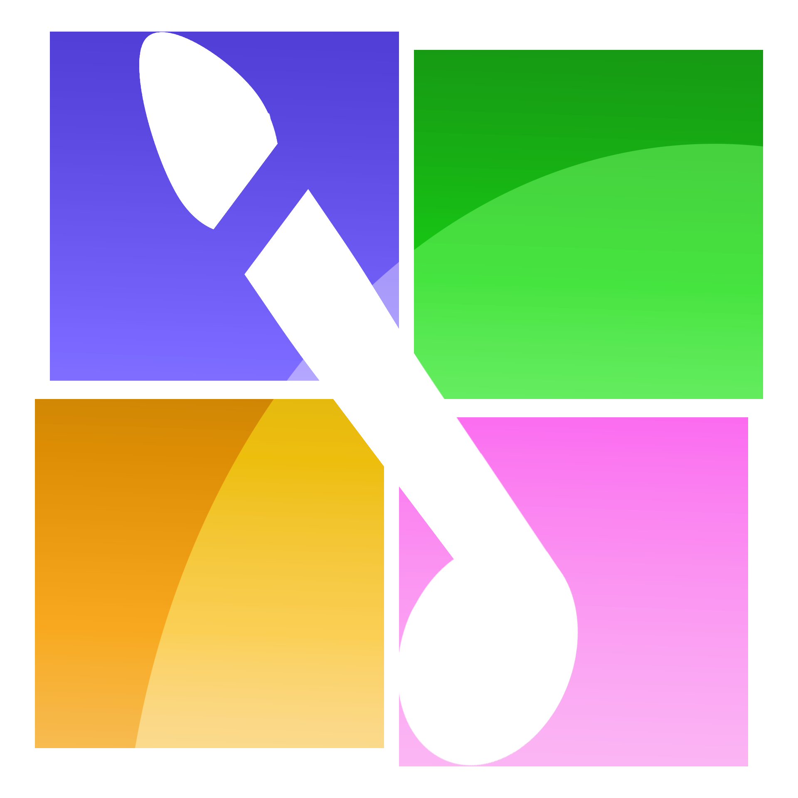

<p align="center">
  
</p>

<h1 align="center">IndieNodes</h1>

IndieNodes is a lightweight, decentralized way to stumble into real indie creators' work: audio, comics and visual art, writing, and eventually games. It is a webring, not a platform: there is no account system, no server-side user data, and no algorithm deciding what surfaces. Members embed a small widget on their own sites, so traffic circulates without IndieNodes needing to be a destination itself.

**Core thesis:** the data is the API. [`ring.json`](./ring.json) is the product. The embeddable widget, the static reader, and the ambient field view are all clients of that data, and any one of them can be retired without taking the ring down.

Design background and the full set of locked product decisions live in an internal project brief, kept outside this repository. Build and design conventions for anyone (human or otherwise) working on this codebase, including the reasoning behind decisions the brief doesn't cover, live in [`docs/`](./docs).

## Status

Project scaffold, design system, theming, the data model (schema, validator, seed data), the submission form, and local-only personalization (Like and Not for Me, both mutually exclusive and reviewable from the Lists page) are in place, along with a Docker image and GHCR publishing. A creator with no site of their own can generate one entirely client-side from `/join` (a choice of hand-designed templates per creator type) and download it ready to host anywhere, with a choice of three embeddable ring links already in its footer: the full Prev/Next/Random widget, an 88×31 badge, or a plain text link. The ambient field view has not been built yet; see [`docs/open-questions.md`](./docs/open-questions.md) for what is still undecided.

## Running locally

Requires Node.js and npm.

```bash
npm install
npm run dev -- --open
```

Other useful scripts:

```bash
npm run build         # static production build (adapter-static, no backend)
npm run build:widget  # rebuild just the embeddable widget bundle (static/embed.js + embed.v1.js)
npm run preview       # preview the production build locally
npm run check         # type-check via svelte-check
npm run lint          # prettier --check + eslint
npm run format        # prettier --write
npm run validate      # validate ring.json against schema/ring.schema.json
npm run test          # unit tests (vitest) + end-to-end tests (playwright)
```

`npm run dev` and `npm run build` both run `build:widget` first automatically.

## How the build works

This is a static site: [`@sveltejs/adapter-static`](https://kit.svelte.dev/docs/adapter-static) builds every route to plain HTML, CSS, and JS with no runtime server. `npm run build` outputs to `build/`, which can be served from any static host. The deployment tooling described in the brief (Docker, Semaphore, Ansible) automates publishing that static output; it is not something the running site depends on.

### Docker

The [`Dockerfile`](./Dockerfile) builds the site and serves it with [Caddy](./Caddyfile) — a static file server, not an application server, since there is no backend process for it to run. Both `VITE_SITE_ORIGIN` and `VITE_SUBMISSION_WEBHOOK_URL` (see below) are compiled into the client bundle at **build** time, so they are `--build-arg`s, not `docker run -e` variables:

```bash
docker build \
  --build-arg VITE_SITE_ORIGIN=https://indienodes.us \
  --build-arg VITE_SUBMISSION_WEBHOOK_URL=https://your-n8n-instance/webhook/... \
  -t indienodes .

docker run -p 8080:8080 indienodes
```

Images are published to GHCR on push to `main` and on version tags; see [`.github/workflows/docker-publish.yml`](./.github/workflows/docker-publish.yml). The webhook URL is sourced from a repository **variable**, not a secret: it ships inside public JavaScript either way, so filing it as a secret would only suggest a guarantee it cannot make.

## `ring.json` and how to submit an entry

`ring.json` at the repository root is the canonical, versioned data source. Every client reads it; nothing writes to it except the submission and publishing pipeline. Its shape is defined formally in [`schema/ring.schema.json`](./schema/ring.schema.json), and `npm run validate` checks a `ring.json` file against it. See [`docs/submission-form-spec.md`](./docs/submission-form-spec.md#21-core-entry-data-maps-to-ringjson) for the field-by-field notes, including the three-track cap for audio and the rule that media is never rehosted (every URL points at infrastructure the creator controls).

**Cover art is encouraged for every entry type, not just games.** `thumb_url` is valid on any entry (the schema only makes it _required_ for games) and the field view uses it as the card's background for all types: album art for audio, a header image for text, a cover for comics. Entries without one fall back to a flat wash of their type color, which is a visibly plainer card. Comics fall back to their first page if no `thumb_url` is given. As with all media, the URL must point at infrastructure the creator controls; nothing is rehosted.

The `/join` page is the submission form itself: a token-verified ownership check, then a private review queue, then a pull request carrying only the public fields above. The form's own half is built and runs against a mock backend in dev automatically; the other half is an n8n workflow (see `docs/submission-form-spec.md` section 7) that a maintainer stands up separately and points the app at via `VITE_SUBMISSION_WEBHOOK_URL`. Without that variable set, a production build says submissions are closed rather than silently accepting them.

## Test data

[`testing/`](./testing) holds the tooling for a separate, richer 50-entry fixture (a mix of real content from a few live third-party sources and locally-served fictional creator pages with working ownership-verification tokens) for exercising each client against realistic data without touching the production seed data in `ring.json`.

**The generated fixture and the fictional creator pages themselves are not committed.** They're local-only (see `.gitignore`), since the fixture includes real, identifying third-party content that has no reason to sit in a public repo. Build your own locally:

```bash
npm run fixture:generate   # the 50-entry JSON + placeholder cover art (deterministic)
npm run fixture:serve      # serves the fixture and testing/sites/ on :4174
npm run dev:fixture        # dev server, reading the fixture instead of ring.json
```

`generate-fixture.mjs` regenerates the JSON and covers, but the four fictional creator pages under `testing/sites/` are hand-authored, not generated; see [`testing/README.md`](./testing/README.md) for what each one needs to contain (mainly, a `<meta name="indienode-verification">` tag matching its fixture entry's token) if you're recreating them from scratch.

## Embedding the widget

Paste this onto any page:

```html
<script type="module" src="https://indienodes.us/embed.v1.js"></script>
<indienode-widget></indienode-widget>
```

That is the whole integration: Previous, Next, and Random over the live ring, with no configuration, no personalization, and no tracking. The widget is a standalone custom element with its own shadow root, so it does not touch your page's stylesheet and your page's stylesheet does not touch it. See it running, and copy the snippet, from the `/widget` page in the running app.

## Theming and backgrounds

Three theme modes (Light, Dark, System) and an optional ambient background are available from the Settings page, both stored in this browser's local storage only. `System` follows your OS setting live. The background is off by default; when enabled, it is drifting particles over slow-moving gradient blobs, capped at 30fps, paused in a background tab, and reduced to a single static frame under `prefers-reduced-motion`. When cross-origin audio is playing (most third-party hosts don't allow this; see below), the field also reacts to it — drift speed follows the beat, and an especially strong hit pulses particle size and spawns a brief burst of extras. See [`docs/audio-reactivity.md`](./docs/audio-reactivity.md) for the full signal path and the `?debug=audio` live-tuning panel used to dial in beat detection against a real track.

## License

GPL-3.0-or-later. See [`LICENSE`](./LICENSE).

## Support

IndieNodes runs on donations only: no ads, no paid placement. See the Support tab of the About dialog in the running app, or go straight to the project's Ko-fi (linked from `src/lib/config.js` once the real URL is set).
